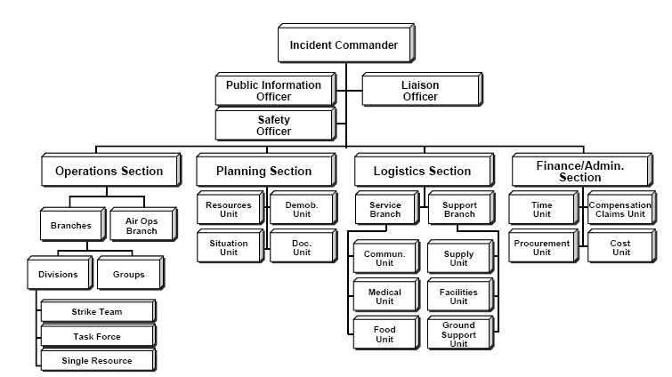

# 1. Planejando a Resposta a um Incidente
A resposta a incidentes é um pilar crucial da engenharia moderna de software e operações. Assegura que, quando problemas surgem, há uma forma estruturada de abordá-los, minimizar impactos e aprender com o ocorrido.

## 1.1 Introdução ao Gerenciamento de Incidentes
Todos desejam que seus serviços funcionem perfeitamente o tempo todo, mas vivemos em um mundo imperfeito onde interrupções ocorrem. Gerenciar um incidente significa coordenar esforços em situações de emergência e assegurar que a comunicação flua entre os participantes e os interessados no progresso do incidente.
## **Princípios Fundamentais da Resposta a Incidentes**
Antes de mergulhar nos detalhes, é vital entender os princípios centrais:

1. **Linha Clara de Comando**: Garante que, durante o caos de um incidente, não haja ambiguidade sobre quem toma decisões.
2. **Papéis Bem Definidos**: Cada pessoa envolvida deve saber suas responsabilidades.
3. **Documentação em Tempo Real**: Registre as ações, decisões e etapas de depuração conforme acontecem.
4. **Declare Incidentes Precocemente**: Melhor comunicar demais do que de menos.
## **O que é um Incidente?**
Um incidente refere-se a qualquer evento inesperado que interrompe ou reduz a qualidade de um serviço, afetando adversamente a experiência dos usuários. Pode variar desde falhas sutis, como degradação de desempenho, até interrupções completas do serviço. Um *incidente maior*, por outro lado, é uma situação mais grave, geralmente envolvendo várias equipes para sua resolução devido ao seu impacto significativo na operação normal do sistema ou na experiência do cliente.

## **Sistema de Comando de Incidentes (ICS)**



*(Fonte: Federal Emergency Management Agency – ICS Resource Center)*

Originado entre bombeiros na Califórnia dos anos 70 para combater incêndios florestais, o ICS é um framework de gerenciamento de resposta a emergências que permite uma resposta coordenada e eficaz. A beleza do ICS reside na sua estrutura modular, o que significa que ele pode ser escalado ou reduzido dependendo das necessidades do incidente. 

Os princípios fundamentais do ICS incluem:

- **Organização Padrão**: Estabelece uma estrutura hierárquica e definida para o gerenciamento e coordenação.
- **Terminologia Comum**: Usa terminologia padrão para evitar mal-entendidos.
- **Procedimentos Integrados**: Incorpora procedimentos e políticas aceitas para eficiência.

Este sistema foi adaptado pelas empresas de tecnologia para lidar com falhas de sistema, com foco em três Cs:

- **Coordenar** esforços de resposta.
- **Comunicar** efetivamente dentro e fora da organização.
- **Controlar** a resposta ao incidente.

## **Principais Papéis na Resposta a Incidentes**
1. **Comandante do Incidente (CI)**: A figura central da resposta ao incidente. O CI tem a visão geral da situação, toma decisões estratégicas e garante que os recursos sejam alocados corretamente.
2. **Líder de Operações (LO)**: Este é o "fazedor". O LO é responsável pela execução das estratégias definidas pelo CI, trabalhando diretamente na resolução do incidente.
3. **Líder de Comunicações (LC)**: Garante que todas as partes interessadas, internas e externas, sejam informadas sobre o status do incidente e quaisquer impactos associados.

## **Severidade do Incidente**
A severidade de um incidente ajuda a determinar a urgência e o tipo de resposta necessários:

- **SEV-1**: Incidentes que têm um impacto crítico nos clientes ou na operação do sistema.
- **SEV-2**: Problemas significativos que afetam muitos usuários, mas não são tão críticos quanto um SEV-1.
- **SEV-3**: Problemas que têm um impacto moderado e podem ter soluções de contorno.
- **SEV-4**: Pequenas interrupções que têm soluções de contorno fáceis.
- **SEV-5**: Problemas mínimos ou estéticos que não afetam a funcionalidade principal.

## **Peacetime x Wartime: Adaptação e Inovação no Gerenciamento de Incidentes**
A ideia de Peacetime e Wartime, embora inicialmente introduzida no contexto da liderança em negócios, tem aplicações interessantes no mundo da resposta a incidentes.

### **Peacetime em Resposta a Incidentes**
Durante o **Peacetime**, os sistemas são estáveis e as equipes se concentram na otimização e na preparação. É um momento para treinamento, revisão de processos e melhorias proativas. O foco é na prevenção: 

- Realização de simulações de incidentes.
- Treinamentos regulares para equipes.
- Avaliação e aprimoramento de ferramentas e plataformas.

### **Wartime em Resposta a Incidentes**
**Wartime** é quando um incidente ocorre. A prioridade é a resolução rápida e eficaz do incidente. Os protocolos são mais rígidos, e a comunicação é frequentemente centralizada para evitar desinformação:

- Acionamento imediato de equipes especializadas.
- Comunicação rápida com stakeholders.
- Análise post-mortem após a resolução do incidente para aprender e evitar repetições.

## **Conexões com o Mundo Real e Resposta a Incidentes**
A gestão estruturada de incidentes não é exclusividade do universo da tecnologia. Diversos setores críticos têm seus próprios protocolos de resposta a incidentes, demonstrando a universalidade desses princípios. Vejamos como se manifestam em alguns setores vitais:

### **Bombeiros**
Os bombeiros são a linha de frente quando se trata de emergências, desde incêndios a desastres naturais e resgates. Sua resposta a incidentes é meticulosamente treinada e aprimorada ao longo dos anos. Aqui está uma visão detalhada de como eles respondem a incidentes:

- **Preparação**: De acordo com a National Fire Protection Association (NFPA) dos EUA, os bombeiros são obrigados a passar por um mínimo de 600 horas de treinamento inicial antes de serem considerados operacionais. Esses treinamentos incluem simulações de incêndio reais, treinamento médico de emergência e treinamento de resgate.

- **Resposta**: Um estudo publicado no *Journal of Safety Research* destacou que a comunicação é um dos fatores mais críticos na resposta eficaz dos bombeiros a incêndios. Assim como um CI em TI, o comandante no local assume a liderança, garantindo comunicação eficaz e delegação de tarefas.

**1. Recebimento e Despacho**
Quando um chamado é recebido, os detalhes do incidente são rapidamente avaliados e transmitidos às equipes relevantes. Isso é feito por um sistema de despacho centralizado que determina a localização do incidente e envia a unidade mais próxima e mais adequada.

**2. Avaliação Inicial no Local**
Ao chegarem ao local, os bombeiros realizam uma avaliação inicial para determinar a gravidade do incidente. Isso envolve identificar fontes de perigo, possíveis vítimas e a melhor abordagem para lidar com a situação.

**3. Estabelecimento de Comando**
Um Comandante de Incidente (CI) é designado para liderar a operação. Semelhante ao CI em TI, este líder toma decisões estratégicas, coordena equipes e comunica-se com outros serviços de emergência.

**4. Prioridades de Resposta**
Os bombeiros seguem um conjunto padrão de prioridades, muitas vezes resumidas como "Vida, Propriedade, Ambiente".

- **Vida**: O resgate e o atendimento médico das vítimas são a maior prioridade.
- **Propriedade**: Isso envolve salvar edifícios, casas e outros bens.
- **Ambiente**: Minimizar danos ao meio ambiente, como a prevenção da propagação de incêndios florestais.

**5. Ação e Mitigação**
Dependendo do incidente, várias táticas podem ser empregadas, desde combater um incêndio com água ou espuma até técnicas de resgate em altura ou em água. Equipamentos especializados, como escadas aéreas ou ferramentas de desencarceramento, podem ser usados.

**6. Comunicação Constante**
A comunicação é vital. A equipe no local está em constante comunicação com a central de despacho e outras equipes, garantindo que todos estejam cientes da situação e de quais recursos estão disponíveis.

**7. Desmobilização e Análise**
Uma vez que o incidente esteja sob controle, as equipes começam a se desmobilizar. Equipamentos são recolhidos e verificados, e veículos são reabastecidos e preparados para a próxima chamada. Finalmente, muitos departamentos de bombeiros realizam análises pós-incidente para aprender com o evento e melhorar futuras respostas.

### **Equipes Médicas de Emergência**
As equipes médicas de emergência (EMT, em inglês) são as primeiras a responder em situações médicas críticas, desde acidentes de trânsito a crises cardíacas em locais públicos. Seu treinamento e protocolos são rigorosos para garantir a prestação de cuidados médicos imediatos e eficazes.

- **Preparação**: Os EMTs passam por um treinamento rigoroso que abrange uma ampla variedade de cenários médicos de emergência, ensinando-os a responder rapidamente e eficazmente.

- **Resposta**: Em caso de emergência, a resposta deve ser imediata. Cada segundo conta quando vidas estão em risco.

1. **Recebimento e Despacho**: Uma chamada é recebida e avaliada rapidamente, enviando a equipe mais próxima e adequada para o local.
2. **Avaliação no Local**: Ao chegarem, os EMTs avaliam rapidamente a situação e decidem o melhor curso de ação.
3. **Prestação de Cuidados Imediatos**: Eles prestam os primeiros socorros necessários, estabilizando o paciente o máximo possível.
4. **Transporte**: Se necessário, o paciente é transportado para o hospital mais próximo, enquanto recebe cuidados contínuos.
5. **Transferência de Cuidados**: Ao chegar ao hospital, a responsabilidade é transferida para a equipe médica de plantão.
6. **Retorno e Preparação**: A equipe retorna à base, preparando-se para a próxima chamada.

### **Pilotos e Controladores de Tráfego Aéreo**
O tráfego aéreo é uma dança complexa que exige coordenação precisa entre pilotos e controladores de tráfego aéreo. A segurança é primordial, e os protocolos são rigorosamente seguidos para garantir que todos os voos decolem, voem e aterrissem com segurança.

- **Preparação**: Tanto pilotos quanto controladores passam por treinamento intensivo, com foco na segurança e na comunicação eficaz.

- **Resposta**: No caso de uma emergência, a resposta deve ser coordenada e rápida para garantir a segurança de todos os envolvidos.

1. **Comunicação**: Esta é a chave. Pilotos e controladores devem estar em comunicação constante, especialmente em situações de emergência.
2. **Monitoramento Contínuo**: Controladores monitoram o tráfego aéreo em tempo real, garantindo que todas as aeronaves estejam seguras.
3. **Coordenação em Emergências**: Em caso de emergência, como um avião precisando de pouso imediato, os controladores coordenam o espaço aéreo para permitir que isso aconteça.
4. **Priorização**: Voos em situação de emergência são priorizados para garantir a segurança de todos.
5. **Coordenação com Outros Entes**: Em caso de emergências maiores, controladores podem precisar coordenar com outros aeroportos ou serviços de emergência.
6. **Análise Pós-Incidente**: Após qualquer incidente, uma análise é feita para entender o que aconteceu e como melhorar no futuro.
## 1.2 Troubleshooting com OpenShift
### A Visão de Topologia do OpenShift
OpenShift oferece uma visão de topologia que permite aos usuários visualizar e gerenciar as aplicações implantadas. Esta visão mostra todos os recursos relacionados, como pods, serviços e rotas, em uma representação gráfica interativa.
  1. **Navegação**: Acesse a console do OpenShift e vá até a guia "Topologia" na seção "Desenvolvedor".
  2. **Visualização**: Aqui, você pode ver todas as aplicações em diferentes estágios de implantação, de containers em construção até os ativos.
  3. **Interação**: Clique em qualquer elemento para obter detalhes específicos, logs ou escalar o número de pods.

### Visualizando Eventos no OpenShift**:
Os eventos no OpenShift fornecem informações sobre o que está acontecendo dentro do cluster. Eles podem mostrar detalhes sobre operações de criação, atualizações ou erros.
  1. **Acesso**: Na console do OpenShift, navegue até a guia "Administração" e selecione "Eventos".
  2. **Filtragem**: Utilize os filtros para ver eventos específicos ou de determinados recursos.
  3. **Detalhes**: Clique em um evento para obter informações mais detalhadas sobre o que causou o evento e quais recursos estão envolvidos.

### Visualizando Logs no OpenShift**:
Logs são essenciais para entender o comportamento de suas aplicações e para diagnosticar problemas.
  1. **Acesso aos Logs de um Pod**: Vá até a visão de pods e selecione o pod desejado. Na página de detalhes do pod, você encontrará uma guia "Logs".
  2. **Visualização**: Os logs do container serão exibidos em tempo real, permitindo que você veja a atividade recente.
  3. **Streaming**: Ative a opção "Stream logs" para visualizar logs em tempo real, o que é útil para diagnosticar problemas em aplicações ativas.

### Introdução a Readiness e Liveness Probes**Introdução a Readiness e Liveness Probes**:
Probes são ferramentas integradas em Kubernetes para verificar a saúde de um container. O `readinessProbe` verifica se o container está pronto para receber solicitações, enquanto que o `livenessProbe` verifica se o container está funcionando conforme o esperado durante sua execução. Ambos são essenciais para garantir que apenas containers saudáveis recebam tráfego e que os containers problemáticos sejam reiniciados.
  1. **Implementação de Probes**:
     - Utilizando o ambiente OpenShift, os participantes serão guiados para adicionar `Readiness` e `Liveness probes` ao `mobility-app`.
      ```yaml
            readinessProbe:
            httpGet:
               path: /q/health/ready
               port: 8080
               scheme: HTTP
            livenessProbe:
            httpGet:
               path: /q/health/live
               port: 8080
               scheme: HTTP
      ```
  2. **Simulação de Falhas no `mobility-app` / Alteração do Endpoint do Liveness Probe**:
      - Modifique o endpoint que o livenessProbe verifica. Se, por exemplo, o livenessProbe verifica /q/health/live, os participantes devem alterar a rota no aplicativo para um endpoint que não exista ou esteja retornando erros. Isso força o probe a falhar e os participantes podem observar como o sistema reage a essa falha.
  3. **Validação e Observação**:
     - Com as probes implementadas, os participantes observarão como o Kubernetes reage quando detecta falhas, garantindo que o tráfego seja encaminhado apenas para pods saudáveis.
### Testes Unitários com Quarkus
Além dos testes unitários padrão, um dos testes a ser observado é o `testAccess` no arquivo [`AccessLogResourceTest.java`](
https://github.com/firefighters-sre/concierge-app/blob/main/src/test/java/com/redhat/quarkus/resources/AccessLogResourceTest.java). Vamos detalhar este teste:
##### testAccess: Verificando a Integração com Kafka
Este teste valida a capacidade do serviço `concierge-app` de enviar registros de acesso ao tópico Kafka `entrance` e, em seguida, consumir esses registros para verificação.

1. **Inicialização e Subscrição ao Tópico Kafka**:
    ```java
    logConsumer.subscribe(Collections.singleton("entrance"));
    ```
   O teste começa se inscrevendo no tópico Kafka `entrance` para ouvir as mensagens que serão produzidas.

2. **Preparação dos Dados**:
    ```java
    AccessLog logToSend = new AccessLog(1L, "1");
    ```
   Um novo objeto `AccessLog` é criado para simular um registro de acesso que será enviado ao tópico Kafka.

3. **Chamada ao Endpoint e Envio de Dados**:
    ```java
    given()
      .when()
      .contentType(ContentType.JSON)
      .body(logToSend)
      .post("/access")
      .then()
      .statusCode(204);
    ```
   Aqui, o endpoint `/access` é chamado com o objeto `AccessLog` preparado. A resposta esperada é um HTTP 204, indicando sucesso sem retorno.

4. **Consumo e Verificação dos Dados**:
    ```java
    ConsumerRecords<String, MoveLog> records = logConsumer.poll(Duration.ofMillis(10000));
    MoveLog receivedLog = records.records("entrance").iterator().next().value();
    ```
   O teste aguarda até 10 segundos para consumir a mensagem do tópico `entrance`. Uma vez consumida, ele extrai o valor da mensagem como um objeto `MoveLog`.

5. **Validação**:
    ```java
    assertEquals(logToSend.getPersonId(), receivedLog.getPersonId());
    assertEquals(logToSend.getDestination(), receivedLog.getDestination());
    assertEquals("elevator", receivedLog.getPreferredRoute());
    ```
   Finalmente, o teste valida se os dados consumidos do tópico Kafka correspondem aos dados enviados originalmente, verificando o ID da pessoa, o destino e a rota preferida.

Este teste garante que o serviço `concierge-app` esteja corretamente integrado com o Kafka, sendo capaz de produzir e consumir mensagens conforme esperado.
