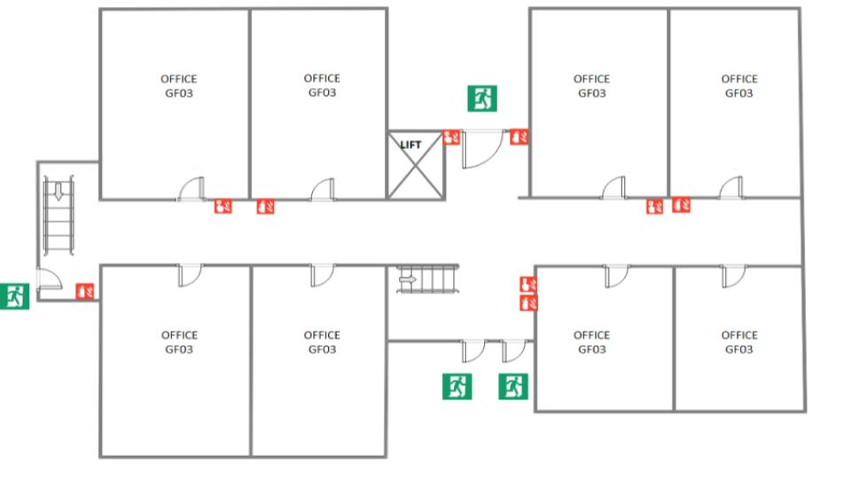
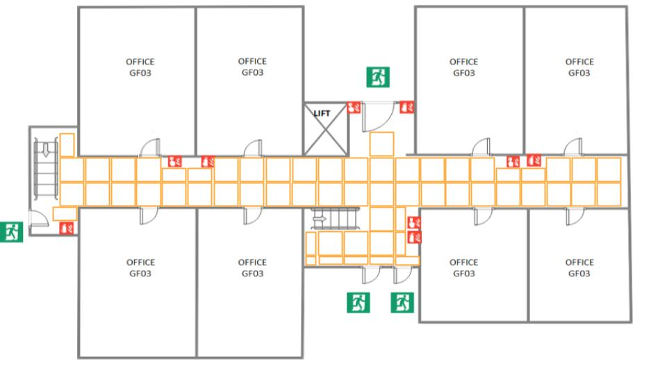

# 1. Planejando a Resposta a um Incidente
## 1.1 Introdução ao Gerenciamento de Incidentes
Todos desejam que seus serviços funcionem perfeitamente o tempo todo, mas vivemos em um mundo imperfeito onde interrupções ocorrem. Gerenciar um incidente significa coordenar esforços em situações de emergência e assegurar que a comunicação flua entre os participantes e os interessados no progresso do incidente.
### Princípios Básicos
- **Linha Clara de Comando**: Mantenha clareza na hierarquia e responsabilidades durante a resposta ao incidente.
- **Papéis Bem Definidos**: Certifique-se de que todos saibam suas responsabilidades e não invadam áreas alheias.
- **Registro de Trabalho**: Mantenha um registro contínuo das ações de depuração e mitigação durante a resposta.
- **Declare Incidentes Precocemente**: Quanto mais cedo um incidente for reconhecido e gerenciado, mais eficaz será a resposta.
### Sistema de Comando de Incidentes (ICS)
O ICS foi estabelecido em 1968 por bombeiros para gerenciar incêndios florestais. Este framework fornece formas padronizadas de se comunicar e atribuir funções claramente especificadas durante um incidente. Com base no sucesso deste modelo, empresas adaptaram o ICS para responder a falhas de computadores e sistemas. O objetivo principal é:
- **Coordenar esforços de resposta**.
- **Comunicar entre os respondedores do incidente, dentro da organização e para o mundo externo**.
- **Manter controle sobre a resposta ao incidente**.
### Principais Papéis na Resposta a Incidentes
1. **Comandante de Incidente (IC)**: Mantém o estado de alto nível sobre o incidente e estrutura a equipe de resposta, delegando responsabilidades conforme a necessidade.
2. **Operações (Ops Lead)**: Trabalha em resposta ao incidente, aplicando ferramentas operacionais para mitigar ou resolver o incidente.
3. **Comunicação (Comms Lead)**: É o rosto público da equipe de resposta ao incidente, fornecendo atualizações periódicas para a equipe e partes interessadas.
### Quando Declarar um Incidente
É preferível declarar um incidente cedo, encontrar uma solução simples e encerrar o incidente do que ter que ativar a estrutura de gerenciamento de incidentes horas após um problema emergente. Declare um incidente se:

- Você precisa envolver uma segunda equipe na solução.
- A interrupção é visível para os clientes.
- O problema não é resolvido mesmo após uma hora de análise concentrada.
  
## 1.2 Abordagem Prática
- **Desafio**: Simular uma situação de emergência no edifício e identificar as melhores rotas de evacuação.
- **Passo-a-Passo**:
  1. **Configuração da Situação de Emergência**:
      - Distribuir um mapa impresso do edifício para cada participante ou equipe. Este mapa deve detalhar o layout, saídas, escadas, elevadores e possíveis obstáculos (por exemplo, locais de incêndio).

     <p align="center">
      
     </p>

      - **Atividade**: Propor uma ação de planejamento, onde serão estabelecidas as rotas mais eficientes em caso de emergência, saindo de cada uma das salas e um manual de evacuação do perímetro, utilizando os recursos disponíveis:
      
            * Saídas de emergência;
            * Alarmes de incêndio; 
            * Extintores de incêndio.


     <p align="center">
      
     </p>

      - Informar os participantes sobre uma situação de emergência simulada:
      🚨**Emergência simulada**: Houve uma explosão de uma peça do elevador devido à alta temperatura. Toda a região pintada de vermelho está em chamas. *(Fornece-se um novo mapa, agora com uma área representando o fogo)*.
      - As equipes são formadas e cada membro recebe um papel específico: IC, Ops Lead ou Comms Lead.
      - Utilizando o mapa fornecido, cada equipe deve identificar potenciais rotas de evacuação e áreas problemáticas.
  2. **Definir Protocolos de Comunicação entre os Respondedores do Incidente**:
     - O Comms Lead deve estabelecer e documentar um plano de comunicação claro. Isso deve incluir a frequência das atualizações, os canais de comunicação a serem usados (por exemplo, chat, e-mail, reuniões) e as partes interessadas que precisam ser informadas.
     - Criar uma checklist ou template para as atualizações de status, garantindo que todas as informações cruciais sejam comunicadas de forma consistente.
     - O Comms Lead deve também estabelecer um protocolo para registrar todas as comunicações importantes. Isso pode ser um documento compartilhado, um sistema de tickets ou outro método preferido.
     - O Ops Lead Criar uma lista de recursos, como documentações, scripts ou playbooks, que podem ser rapidamente acessados durante um incidente.
     - Criar um plano de ação claro para abordar quaisquer lacunas ou melhorias identificadas durante a revisão.
  3. **Estabelecer Responsabilidades e Protocolos de Controle para a Resposta ao Incidente**:
     - O IC deve documentar claramente suas responsabilidades durante um incidente. Isso inclui monitorar o progresso, tomar decisões estratégicas e garantir que todos os respondentes estejam alinhados.
     - Criar um conjunto de cenários hipotéticos e discutir como o IC e a equipe responderiam a cada um. Isso ajuda a esclarecer as responsabilidades e a preparar a equipe para desafios reais.
     - Ao final de cada cenário discutido, o IC deve revisar as ações propostas pela equipe, garantindo que sejam eficazes e alinhadas com os protocolos estabelecidos.

## 1.3 Plataforma e Ferramentas
- **Passo-a-Passo**:
  1. **Visão Geral**: Introdução ao sistema Firefighters SRE, um sistema projetado para simular a gestão e monitoramento de um edifício. Diferentes microserviços são responsáveis por monitorar e gerenciar aspectos específicos, como acesso de pessoas, mobilidade, ambiente e segurança do edifício.
    - **Stack Tecnológica**:
       - Microserviços: Quarkus
       - Plataforma de Mensagens: AMQ Streams (Kafka) e Red Hat Fuse (Apache Camel)
       - Banco de Dados: PostgreSQL
       - Implantação: OpenShift (Kubernetes com Helm charts)
       - Monitoramento e Rastreamento: Prometheus, Jaeger e Grafana
    - **Microserviços**:
       - 🛎️ [**Access Microservice (concierge-app)**](https://github.com/firefighters-sre/concierge-app): Gerencia a entrada e saída de indivíduos do edifício.
       - 🚶‍♂️🔝 [**Mobility Microservice (mobility-app)**](https://github.com/firefighters-sre/mobility-app): Monitora e gerencia a utilização de escadas e elevadores.
       - 🏠 [**Building Microservice (building-app)**](https://github.com/firefighters-sre/building-app): Gerencia informações relacionadas ao edifício, como temperatura, qualidade do ar e ocupação do piso.
    - **Tópicos Kafka**:
       - `Lobby (lobby)`: Coleta eventos relacionados às atividades no saguão do edifício.
       - `Lobby (lobby)`: Coleta eventos relacionados às atividades no saguão do edifício.
       - `Entrance (entrance)`: Manipula eventos pós-processamento do Lobby, marcando a entrada de indivíduos no edifício.
       - `Elevator (elevator)`: Captura eventos associados às operações do elevador.
       - `Stairs (stairs)`: Coleta dados sobre o uso de escadas.
       - `Exit (exit)`: Coleta eventos relacionados à saída de indivíduos do edifício.
       - `External (external)`: Coleta eventos originados de sistemas ou dispositivos externos ao edifício.
  2. **Testes Unitários com Quarkus**:
    - Demonstração de como configurar e executar `testes unitários` na aplicação quarkus `concierge-app`.
### Testes Unitários com Quarkus
Além dos testes unitários padrão, um dos testes a ser observado é o `testAccess` no arquivo [`AccessLogResourceTest.java`](
https://github.com/firefighters-sre/concierge-app/blob/main/src/test/java/com/redhat/quarkus/resources/AccessLogResourceTest.java). Vamos detalhar este teste:
##### testAccess: Verificando a Integração com Kafka
Este teste valida a capacidade do serviço `concierge-app` de enviar registros de acesso ao tópico Kafka `entrance` e, em seguida, consumir esses registros para verificação.

1. **Inicialização e Subscrição ao Tópico Kafka**:
    ```java
    logConsumer.subscribe(Collections.singleton("entrance"));
    ```
   O teste começa se inscrevendo no tópico Kafka `entrance` para ouvir as mensagens que serão produzidas.

2. **Preparação dos Dados**:
    ```java
    AccessLog logToSend = new AccessLog(1L, "1");
    ```
   Um novo objeto `AccessLog` é criado para simular um registro de acesso que será enviado ao tópico Kafka.

3. **Chamada ao Endpoint e Envio de Dados**:
    ```java
    given()
      .when()
      .contentType(ContentType.JSON)
      .body(logToSend)
      .post("/access")
      .then()
      .statusCode(204);
    ```
   Aqui, o endpoint `/access` é chamado com o objeto `AccessLog` preparado. A resposta esperada é um HTTP 204, indicando sucesso sem retorno.

4. **Consumo e Verificação dos Dados**:
    ```java
    ConsumerRecords<String, MoveLog> records = logConsumer.poll(Duration.ofMillis(10000));
    MoveLog receivedLog = records.records("entrance").iterator().next().value();
    ```
   O teste aguarda até 10 segundos para consumir a mensagem do tópico `entrance`. Uma vez consumida, ele extrai o valor da mensagem como um objeto `MoveLog`.

5. **Validação**:
    ```java
    assertEquals(logToSend.getPersonId(), receivedLog.getPersonId());
    assertEquals(logToSend.getDestination(), receivedLog.getDestination());
    assertEquals("elevator", receivedLog.getPreferredRoute());
    ```
   Finalmente, o teste valida se os dados consumidos do tópico Kafka correspondem aos dados enviados originalmente, verificando o ID da pessoa, o destino e a rota preferida.

Este teste garante que o serviço `concierge-app` esteja corretamente integrado com o Kafka, sendo capaz de produzir e consumir mensagens conforme esperado.
