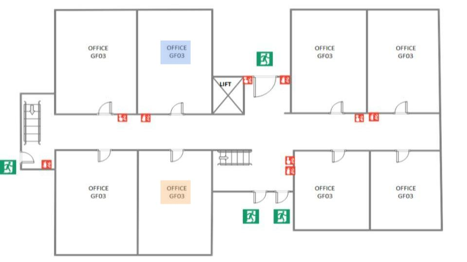

**Desafio:** Divisão do grupo em dois sub-grupos. Um sub-grupo sairá da sala, enquanto o outro solucionará um novo incidente e documentará as medidas tomadas. Em seguida, o segundo grupo receberá essa documentação e tentará resolver, da mesma maneira, o problema.

**Passo-a-Passo:**
🚨 Apresentação do Cenário: Após um acidente com a caixa d'água, o quinto e último andar do prédio sofreu uma inundação. Entretanto, a água que invadiu os corredores entrou em contato com a rede elétrica e causou um curto circuito na região das salas ROXA e LARANJA. Ninguém se feriu, pois as salas estavam vazias. Porém, esse curto circuito comprometeu a circulação no oeste do corredor central. É necessário esvaziar o andar sem feridos.

      

