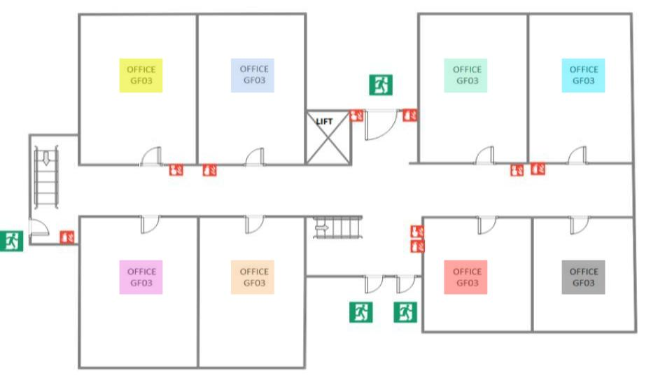

## 🎯 3. Postmortem e RCA: Guia da Atividade

### 🚨 Desafio
Após um incidente com a caixa d'água, o último andar foi inundado e ocorreu um curto circuito nas salas ROXA e LARANJA. Seu desafio é resolver o incidente e documentar as medidas tomadas.

### 📋 Instruções

1. **🌊 Contexto**:
    - Use post-its para listar os principais detalhes da inundação e do curto circuito nas salas ROXA e LARANJA.

2. **🤝 Divisão em Sub-Grupos**:
    - Se você faz parte do primeiro sub-grupo, sua tarefa é identificar e resolver o incidente.
    - Se você faz parte do segundo sub-grupo, aguarde fora da sala até ser chamado novamente.

3. **🔎 Investigação do Incidente**:
    - Consulte os documentos [LOGS.md](./LOGS.md) e [INITIAL_REPORT.md](./INITIAL_REPORT.md) para obter informações detalhadas sobre o incidente.
    - Analise os logs e o relatório inicial para entender melhor a sequência de eventos e identificar possíveis causas.

4. **🔧 Solução do Incidente**:
    - Converse com seu sub-grupo para construir possíveis soluções ao incidente.
    - Use post-its para documentar as medidas tomadas, assegurando clareza e concisão.

5. **📜 Construção do Documento Post-Mortem**:
    - Com base nas informações coletadas e nas soluções identificadas, construa um documento post-mortem utilizando post-its. 
    - Organize os post-its de forma a detalhar claramente o que aconteceu, as causas raiz identificadas, as medidas tomadas e as recomendações para evitar futuros incidentes.

6. **📝 Utilização da Documentação**:
    - Se você faz parte do segundo sub-grupo, ao retornar, pegue os post-its produzidos pelo primeiro sub-grupo e tente replicar a solução usando apenas essa documentação.

7. **🔄 Reflexão e Feedback**:
    - Reúna-se com todos os grupos para discutir a eficácia da documentação e compartilhar insights. Use post-its para registrar os principais feedbacks e lições aprendidas.

---

## Exemplo de Documento Postmortem

### Título: Inundação e Curto-Circuito no Último Andar

#### Descrição do Incidente:
- **Data e Hora**: [Data] às [Hora]
- **Duração**: [X] horas
- **Impacto**: Inundação no último andar, curto circuito nas salas ROXA e LARANJA, comprometendo a circulação no corredor central.

#### Causa Raiz:
Um vazamento na caixa d'água levou à inundação do último andar, e a água entrou em contato com a fiação elétrica, causando um curto-circuito.

#### Medidas Tomadas:
1. Desligar a eletricidade do andar para evitar mais danos e garantir a segurança.
2. Isolar a área afetada.
3. Utilizar equipamento de drenagem para remover a água acumulada.
