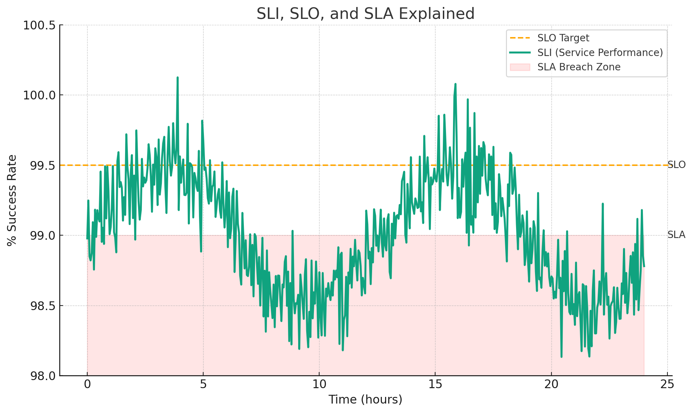

# 2. Monitoramento, SLIs, SLOs, SLAs

No universo da Engenharia de Confiabilidade (SRE), o monitoramento é um pilar fundamental. Ele permite que as equipes de engenharia mantenham um pulso constante na saúde e no desempenho de seus sistemas, garantindo que os serviços atendam às expectativas definidas em termos de confiabilidade e disponibilidade. O monitoramento eficaz é vital para identificar rapidamente problemas potenciais e agir antes que esses problemas afetem adversamente os usuários ou a integridade do sistema.

## 2.1 A Fundamentação do Monitoramento em Engenharia de Confiabilidade (SRE)
O monitoramento é a espinha dorsal da Engenharia de Confiabilidade (SRE). Ele nos capacita a compreender e otimizar a saúde e o desempenho de nossos sistemas, permitindo:

- **Antecipar problemas** através de alertas proativos.
- **Diagnóstico rápido** de questões emergentes.
- **Visualização clara** do estado e comportamento do sistema.
- **Análise de tendências**, auxiliando no planejamento de longo prazo.
- **Comparação de métricas** para avaliar impactos de mudanças ou experimentos.
### Conceitos Chave

- **SLIs (Indicadores de Nível de Serviço)**: São métricas específicas e quantificáveis que representam aspectos essenciais da qualidade do serviço, como tempo de resposta e taxa de erro.
- **SLOs (Objetivos de Nível de Serviço)**: São metas ou limites estabelecidos para os SLIs. Representam o nível mínimo aceitável de desempenho ou confiabilidade de um serviço.
- **SLAs (Acordos de Nível de Serviço)**: São compromissos contratuais que descrevem o nível de serviço esperado, normalmente associados a penalidades ou recompensas.


#### SLIs (Indicadores de Nível de Serviço)
SLIs são métricas específicas e quantificáveis escolhidas para representar a qualidade e o desempenho de um serviço. Eles são vitais para compreender a experiência do usuário e identificar áreas de melhoria. Por exemplo:

- **Latência**: O tempo que leva para uma solicitação ser processada.
- **Taxa de Erro**: A porcentagem de todas as solicitações que resultam em um erro.
- **Taxa de Tráfego**: A porcentagem de solicitações válidas por segundo.

O cálculo do SLI depende da métrica específica em questão. No exemplo da disponibilidade, o SLI seria calculado da seguinte forma:

`SLI (Disponibilidade)` = (`Total de minutos em que o serviço esteve disponível` / `Total de minutos no período de medição`) x 100%

#### SLOs (Objetivos de Nível de Serviço)
SLOs são metas estabelecidas para os SLIs. Eles definem as expectativas de desempenho e confiabilidade. Por exemplo:

- **Latência**: 95% das solicitações devem ser processadas em menos de 200ms.
- **Taxa de Erro**: Menos de 0,1% das solicitações devem resultar em erros.
- **Disponibilidade**: O serviço deve estar disponível 99,9% do tempo.

#### SLAs (Acordos de Nível de Serviço)
SLAs são acordos formais, muitas vezes estabelecidos entre provedores de serviço e clientes. Eles especificam os níveis de serviço esperados e podem incluir penalidades para os casos em que os SLOs não são atendidos. Por exemplo, um SLA pode estipular:

- Se a latência exceder 200ms por mais de 0,1% das solicitações em um mês, o cliente receberá créditos de serviço.
- Se o serviço tiver uma disponibilidade inferior a 99,9% em um mês, poderá haver reembolsos ou outros tipos de compensação para o cliente.

### Escolhendo os Indicadores Corretos
Escolher os SLIs corretos é fundamental para o monitoramento eficaz. Os SLIs devem refletir de maneira precisa e objetiva o que os usuários realmente experimentam.

#### Dicas para Escolher SLIs Corretos:
- **Orientado ao Usuário**: Métricas que afetam diretamente a experiência do usuário, como latência de resposta ou taxa de erros.
- **Quantificável e Mensurável**: O SLI deve ser algo que pode ser medido de forma confiável e consistente.
- **Abrangente**: O SLI deve cobrir uma ampla gama de casos de uso.

### Estabelecendo SLOs de Maneira Efetiva
Os SLOs representam as metas que queremos atingir com base nos SLIs.

#### Dicas para Definir SLOs Corretamente:
- **Colaboração**: Converse com stakeholders para estabelecer SLOs.
- **Histórico de Desempenho**: Analise o desempenho histórico do serviço.
- **Flexibilidade**: SLOs podem precisar ser ajustados conforme o sistema evolui.

### Error Budget: Uma Métrica para a Confiabilidade
O conceito de "Error Budget" é central para a Engenharia de Confiabilidade do Site (SRE). Ele representa a quantidade de tempo ou o número de erros que um serviço é permitido ter, de acordo com seu SLO. Em outras palavras, se um serviço tem um SLO de 99,9% de disponibilidade, ele tem um "Error Budget" de 0,1% de tempo de inatividade permitido.

#### Como calcular o Error Budget:
Error Budget = 100% - SLO

Para um SLO de 99,9% de disponibilidade, o Error Budget seria:
Error Budget = 100% - 99,9% = 0,1%

#### Utilizando o Error Budget:
1. **Inovação vs. Estabilidade**: O Error Budget proporciona um equilíbrio entre a estabilidade do serviço e a velocidade de inovação.
2. **Priorizando o Trabalho**: Se um serviço está se aproximando de esgotar seu Error Budget, a equipe pode decidir congelar lançamentos ou mudanças e focar em estabilização.
3. **Comunicação com Stakeholders**: Um Error Budget fornece uma métrica clara e objetiva para comunicar a saúde e confiabilidade do serviço a stakeholders.
4. **Decisões Baseadas em Dados**: Ao monitorar o consumo do Error Budget, as equipes podem tomar decisões informadas sobre riscos, investimentos em confiabilidade e a velocidade das mudanças.

#### Quando utilizar o Error Budget:
- **Planejamento de Releases**: Antes de fazer grandes lançamentos ou mudanças, verifique o Error Budget.
- **Revisões de Incidentes**: Após incidentes significativos, avalie o impacto no Error Budget.
- **Planejamento de Recursos**: Se um serviço estiver consistentemente esgotando seu Error Budget, pode ser um indicador de que mais recursos são necessários.
- **Negociações de SLO/SLA**: O Error Budget pode ser usado como uma ferramenta de negociação ao discutir ou revisar SLOs e SLAs.

### Consequências de Exaurir o Error Budget
Quando o Error Budget de um serviço é exaurido ou está próximo de ser gasto, é um indicativo claro de que a confiabilidade do serviço está em risco. Aqui estão algumas ações e consequências típicas que ocorrem quando o Error Budget é gasto:

1. **Congelamento de Lançamentos de Recursos (Feature Freeze)**: Para proteger a confiabilidade do serviço e seus usuários, as equipes podem decidir congelar todos os novos lançamentos de recursos até que a saúde do serviço seja restaurada e o Error Budget seja recuperado.
2. **Priorização de Itens Pós-Mortem**: A análise pós-incidente (ou pós-mortem) é crucial para entender a causa raiz dos incidentes e identificar medidas corretivas. Quando o Error Budget é gasto, os itens de ação identificados em revisões pós-incidente tornam-se uma prioridade máxima.
3. **Melhorando o Monitoramento e Observabilidade**: A exaustão do Error Budget frequentemente destaca áreas onde o monitoramento e a observabilidade são insuficientes. Pode ser necessário implementar monitores, alertas adicionais ou ferramentas de diagnóstico para melhorar a visibilidade do sistema e permitir uma resposta mais proativa a futuros incidentes.
4. **Moratória de Novos Recursos**: Até que o Error Budget seja recuperado, a equipe deve se abster de lançar novos recursos. Isso permite que a equipe se concentre totalmente em restaurar a confiabilidade do serviço.
5. **Reestruturação do Fluxo de Trabalho da Equipe**: Os itens de ação das revisões pós-incidente são elevados na lista de prioridades da equipe, garantindo que os problemas identificados sejam abordados prontamente.

A gestão eficaz do Error Budget, juntamente com a resposta apropriada quando ele é gasto, é vital para manter a confiabilidade do serviço e a confiança dos usuários e stakeholders.

### Onde Gastamos o Error Budget?

O Error Budget representa uma quantia "aceitável" de indisponibilidade ou degradação do serviço. Aqui estão algumas áreas comuns onde o Error Budget pode ser "gasto":

1. **Lançamentos de Novos Recursos (Feature Releases)**: Introduzir novas funcionalidades ou mudanças pode, por vezes, resultar em problemas não previstos que afetam a disponibilidade ou desempenho.
2. **Planejamento de Mudanças nos Sistemas**: Atualizações, manutenções ou outras mudanças planejadas nos sistemas podem consumir parte do Error Budget se não forem executadas perfeitamente.
3. **Falha Inevitável**: Falhas em componentes de hardware, problemas de rede ou interrupções de provedores externos podem ocorrer, afetando a disponibilidade.
4. **Tempo de Inatividade Planejado**: Manutenções ou atualizações planejadas que resultam em tempo de inatividade programado consomem o Error Budget.
5. **Experimentos**: Testar novas abordagens, arquiteturas ou tecnologias pode ter um impacto temporário na confiabilidade.

É vital entender e monitorar onde o Error Budget está sendo gasto para fazer ajustes e melhorias contínuas, garantindo a confiabilidade do serviço.

### Monitoramento na Prática
O monitoramento eficaz não se trata apenas de coletar métricas. Envolve interpretar esses dados, tomar decisões informadas e agir proativamente para garantir a saúde contínua dos sistemas. Através de atividades práticas, os participantes aprenderão a estabelecer um monitoramento robusto, definindo SLIs, SLOs e SLAs para serviços críticos, e a responder a incidentes usando dados de monitoramento.

### 4 SRE Golden Signals
Ao monitorar sistemas voltados para o usuário, é essencial focar nos "4 SRE Golden Signals", que são:

1. **Latência**: Refere-se ao tempo necessário para atender a uma solicitação. É crucial diferenciar entre a latência de solicitações bem-sucedidas e falhas.
2. **Tráfego**: Representa a demanda colocada no seu sistema. Pode ser medido como solicitações por segundo ou outras métricas específicas do sistema.
3. **Erros**: Indica a taxa de solicitações que falham, seja explicitamente ou implicitamente.
4. **Saturação**: Mostra quão "cheio" está o seu serviço, destacando os recursos mais restritos.

Ao medir e alertar com base nesses quatro sinais, podemos garantir que o sistema esteja bem monitorado e que quaisquer problemas sejam rapidamente identificados e resolvidos.

### Alertas
Alertas são notificações ou avisos que são acionados quando uma métrica específica (como um SLI) ultrapassa um limite definido. Por exemplo, se a latência de um serviço exceder 500ms ou a taxa de erro superar 1%, um alerta pode ser disparado para notificar a equipe de operações.

Estabelecer alertas eficazes requer:
1. **Granularidade**: Alertas devem ser específicos o suficiente para indicar o problema real sem causar muitos falsos positivos.
2. **Urgência**: Nem todos os alertas são críticos. É importante classificar alertas com base na gravidade do problema.
3. **Ação**: Um alerta deve fornecer informações suficientes para que a equipe possa agir e resolver o problema.
### Dashboards
Dashboards são painéis visuais que exibem métricas e KPIs (Indicadores Chave de Performance) em tempo real. Eles são essenciais para o monitoramento pois:
1. **Visualização**: Permitem que as equipes vejam rapidamente o estado atual do sistema.
2. **Tendências**: Dashboards ajudam a identificar tendências ao longo do tempo, permitindo uma resposta proativa.
3. **Correlação**: Ao visualizar várias métricas juntas, é possível identificar correlações entre diferentes partes do sistema.
## 2.2 Plataforma e Ferramentas

### Ferramentas de Monitoramento e Alertas
Ao coletar métricas de aplicações e sistemas, é essencial ter ferramentas robustas que não apenas armazenem e visualizem esses dados, mas também forneçam mecanismos eficazes de alerta para situações anômalas. Aqui, descrevemos três ferramentas centrais usadas para esses propósitos:

- **Prometheus**:
  - **Descrição**: Prometheus é uma ferramenta de monitoramento e alerta de código aberto que se integra perfeitamente a sistemas e aplicações para coletar métricas em intervalos específicos.
  - **Repositório do Template**: O template usado para configurar e implantar o Prometheus no OpenShift está disponível [aqui](https://github.com/quarkus-sre/charts/tree/main/charts/prometheus).

- **AlertManager**:
  - **Descrição**: Gerencia os alertas enviados pelo Prometheus, agrupando-os e roteando-os para o destino correto, como e-mail, Slack ou outras integrações.
  - **Repositório do Template**: O template usado para configurar e implantar o AlertManager no OpenShift pode ser encontrado [aqui](https://github.com/quarkus-sre/charts/blob/main/charts/prometheus/templates/alertmanager.yaml).

- **Grafana**:
  - **Descrição**: Grafana é uma plataforma de visualização de métricas que permite criar e visualizar dashboards com dados coletados pelo Prometheus.
  - **Repositório dos Dashboards**: Este repositório contém configurações de dashboards Grafana personalizadas e está localizado [aqui](https://github.com/firefighters-sre/grafana-dashboards).
    - [Service Levels Dashboard](https://github.com/firefighters-sre/grafana-dashboards/blob/main/grafana-servicelevels-dashboard.json): Fornece insights sobre os níveis de serviço do aplicativo ou sistema.
    - [SRE Dashboard](https://github.com/firefighters-sre/grafana-dashboards/blob/main/grafana-sre-dashboard.json): Oferece uma visão geral da confiabilidade do sistema e outras métricas-chave de SRE.
  - **Repositório do Template Grafana**: A configuração usada para implantar o Grafana no OpenShift pode ser encontrada [aqui](https://github.com/quarkus-sre/charts/tree/main/charts/grafana).


- **Desafio**: Utilizar o OpenShift para implementar e monitorar as soluções discutidas anteriormente.
- **Passo-a-Passo**:
  1. **Integração com Quarkus**:
     - Demonstração de como usar as extensões Quarkus (`quarkus-smallrye-health`, `quarkus-micrometer-registry-prometheus`) para monitoramento e health checks do `concierge-app`.
     - Configuração de métricas(`@Timed`) nas classes (`AccessLogResource`, `AccessLogService`) usando as bibliotecas Quarkus(`microprofile-metrics-api`).
     - Visão geral de como as métricas(`/q/metrics`) e verificações de integridade do Quarkus se integram ao OpenShift e Prometheus com o `PodMonitor`.
  2. Introdução à interface do OpenShift e suas capacidades de monitoramento. (OpenShift Monitoring, Prometheus Operator, Dashboards)  
  3. **Exploração da Implementação Atual**:
     - Visão geral das três aplicações no OpenShift. `Topology`
     - Introdução às métricas existentes e como elas são coletadas e exibidas no Grafana e Prometheus. `Prometheus`, `ServiceMonitor`, `Grafana`
     - Análise da comunicação entre as aplicações através do Kafka. `Dashboard Grafana Kafka Exporter` 
  4. Implementação dos KPIs discutidos anteriormente no OpenShift, configurando alertas e dashboards.
  5. **Otimização do Monitoramento**:
     - Introdução às métricas existentes e como elas são coletadas e exibidas no Grafana e Prometheus. `Prometheus`, `ServiceMonitor`, `Grafana`
     - Avaliação das métricas atuais e identificação de possíveis lacunas ou métricas adicionais. `Dashboard Grafana Service Levels`  `Dashboard Grafana SRE` 
     - Configuração de alertas no Prometheus para métricas críticas. `Alert Manager`
     - Discussão sobre como os SLIs, SLOs e SLAs existentes se traduzem em configurações no Prometheus e Grafana. `PrometheusRules`

### Monitoramento com Quarkus e OpenShift
O serviço [`concierge-app`](https://github.com/firefighters-sre/concierge-app/blob/main/pom.xml), além de seus endpoints padrão, expõe métricas e verificações de saúde graças às extensões Quarkus.

Essas métricas monitoram o tempo que leva para processar eventos do lobby, fornecendo insights valiosos sobre a eficiência e o desempenho do sistema em situações do mundo real.

1. **Definição da Métrica**:

Vamos focar especificamente nas métricas `processLobbyPostTime` e `processLobbyEventTime`.

1. Na classe [`AccessLogResource`](https://github.com/firefighters-sre/concierge-app/blob/main/src/main/java/com/redhat/quarkus/resources/AccessLogResource.java):
    ```java
    @Timed(name = "processLobbyPostTime", description = "Time taken to process a lobby POST call.", unit = MetricUnits.MILLISECONDS)
    ```
2. Na classe [`AccessLogService`](https://github.com/firefighters-sre/concierge-app/blob/main/src/main/java/com/redhat/quarkus/services/AccessLogService.java):
    ```java
    @Timed(name = "processLobbyEventTime", description = "Time taken to process a lobby event.", unit = MetricUnits.MILLISECONDS)
    ```

A anotação `@Timed` define a métrica, especificando seu nome, descrição e unidade de medida. Ela instrui o Quarkus a coletar dados sobre o tempo que leva para executar o método anotado.
Quando os métodos anotados com `@Timed` são invocados, o Quarkus coleta automaticamente os dados de tempo de execução. Estes dados são expostos através do endpoint `[APP_URL/q/metrics](APP_URL/q/metrics)`. Esta coleta e exposição de métricas é facilitada pelo Micrometer, uma biblioteca de instrumentação de aplicativos que suporta uma variedade de sistemas de monitoramento.

2. **Micrometer Metrics**: 

O Micrometer se posiciona como uma fachada para a instrumentação de aplicações, permitindo que desenvolvedores coletem métricas sem se vincularem a uma solução de monitoramento específica. Ao integrar o Micrometer com o Quarkus, somos capazes de expor uma rica gama de métricas através do endpoint `/q/metrics`.

Apenas adicionando a extensão Micrometer, uma vasta quantidade de métricas são expostas por padrão. Estas incluem:
   - Métricas sobre a JVM, como:
     - Número de threads vivas: `jvm_threads_live_threads`
     - Uso de memória, garbage collection, e outras métricas relacionadas ao ciclo de vida da JVM.
   - Métricas sobre o sistema operacional, incluindo:
     - Uso atual da CPU: `system_cpu_usage`
     - Contagem de processadores disponíveis, carga de trabalho, entre outros.

3. **Integração com OpenShift**:
Quando o serviço `concierge-app` é implantado no OpenShift, os recursos `PodMonitor` e `ServiceMonitor` são utilizados para detectar automaticamente os endpoints de métricas expostos e integrá-los ao sistema de monitoramento Prometheus. Isso permite que os operadores visualizem as métricas em tempo real no painel do OpenShift.

#### ServiceMonitor
O recurso `ServiceMonitor` é uma definição customizada que instrui o Prometheus sobre como monitorar serviços no Kubernetes. Vamos examinar a configuração do `ServiceMonitor` para o `concierge-app`:
```yaml
apiVersion: monitoring.coreos.com/v1
kind: ServiceMonitor
metadata:
  name: concierge-app
  namespace: kafka-logging
  labels:
    helm.sh/chart: quarkus-app-chart-1.0.3
    app.kubernetes.io/name: concierge-app
    ...
spec:
  namespaceSelector:
    matchNames:
      - helm-test
  endpoints:
    - interval: 15s
      path: /q/metrics
      port: tcp-8080
      scheme: http
  selector:
    matchLabels:
      deploymentconfig: concierge-app
```
Nesta definição, especificamos que o Prometheus deve coletar métricas do endpoint /q/metrics a cada 15 segundos.

#### PodMonitor
O PodMonitor é semelhante ao ServiceMonitor, mas, como o nome sugere, ele se destina a monitorar pods individuais. Aqui está a configuração para o concierge-app:

```yaml
apiVersion: monitoring.coreos.com/v1
kind: PodMonitor
metadata:
  name: concierge-app
  namespace: kafka-logging
  labels:
    helm.sh/chart: quarkus-app-chart-1.0.3
    app.kubernetes.io/name: concierge-app
    ...
spec:
  namespaceSelector:
    matchNames:
      - helm-test
  podMetricsEndpoints:
    - interval: 15s
      path: /q/metrics
      targetPort: 8080
      scheme: http
  selector:
    matchLabels:
      deploymentconfig: concierge-app
```
Novamente, estamos instruindo o Prometheus para coletar métricas do endpoint /q/metrics a cada 15 segundos, mas, neste caso, diretamente dos pods.

Com essas definições em vigor, o OpenShift, juntamente com o Prometheus, pode automaticamente descobrir e monitorar as métricas do concierge-app.

4. **Visualização e Alertas**:
Com as métricas sendo coletadas pelo Prometheus, é essencial ter ferramentas que permitam visualizar essas métricas e configurar alertas para monitorar de perto a saúde e o desempenho do sistema. Grafana é uma plataforma de análise e monitoramento amplamente utilizada para visualizar métricas, enquanto PrometheusRules pode ser usada para definir condições de alerta com base nas métricas coletadas.
#### Dashboards Grafana
  - **Repositório dos Dashboards**: Este repositório contém configurações de dashboards Grafana personalizadas para monitoramento de níveis de serviço e métricas de SRE (Engenharia de Confiabilidade do Site). Está localizado [aqui](https://github.com/firefighters-sre/grafana-dashboards).
  - **Dashboards Disponíveis**:
    - [Service Levels Dashboard](https://github.com/firefighters-sre/grafana-dashboards/blob/main/grafana-servicelevels-dashboard.json): Este painel oferece insights sobre os níveis de serviço do aplicativo ou sistema. Inclui métricas como SLIs, SLOs e taxas de erro.
    - [SRE Dashboard](https://github.com/firefighters-sre/grafana-dashboards/blob/main/grafana-sre-dashboard.json): Feito para equipes de SRE, este painel fornece uma visão geral da confiabilidade do sistema, taxas de erro e outras métricas-chave de SRE.
#### Regras do Prometheus (PrometheusRules)
As regras do Prometheus são configurações que definem condições sob as quais alertas serão enviados. As regras para o `concierge-app` estão definidas como:

```yaml
apiVersion: monitoring.coreos.com/v1
kind: PrometheusRule
metadata:
  name: concierge-app-slos
  namespace: kafka-logging
  labels:
    role: alert-rules
    app: prometheus
spec:
  groups:
  - name: concierge-app.slos.rules
    rules:
    # Availability: Ensures that the application has an uptime of 99.9% over a 10-minute window.
    - alert: concierge-app Availability Below Threshold
      annotations:
        message: 'concierge-app in namespace helm-test has been unavailable for more than 0.1% in the last 10 minutes.'
      expr: (1 - avg_over_time(up{namespace="helm-test", app="concierge-app"}[10m])) > 0.001
      for: 1m
      labels:
        severity: warning

    # API Response Time: Average response time for API requests should be under 200ms.
    - alert: concierge-app High API Response Time
      annotations:
        message: 'concierge-app in namespace helm-test has an average response time of more than 200ms in the last 10 minutes.'
      expr: rate(http_request_duration_seconds_sum{namespace="helm-test", app="concierge-app"}[10m]) / rate(http_request_duration_seconds_count{namespace="helm-test", app="concierge-app"}[10m]) > 0.2
      for: 10m
      labels:
        severity: warning

    # Error Rate: Less than 0.1% of all API requests should result in errors (4xx and 5xx responses).
    - alert: concierge-app High Error Rate
      annotations:
        message: 'concierge-app in namespace helm-test has an error rate of more than 0.1% in the last 10 minutes.'
      expr: rate(http_requests_total{namespace="helm-test", app="concierge-app", status=~"4..|5.."}[10m]) / rate(http_requests_total{namespace="helm-test", app="concierge-app"}[10m]) > 0.001
      for: 10m
      labels:
        severity: warning
```

Estas regras definem condições para alertas como disponibilidade do aplicativo, tempo de resposta da API e taxas de erro. Uma vez que estas condições são atendidas, alertas são disparados.

Monitorar o tempo de processamento dos eventos do lobby é crucial para garantir que o serviço esteja respondendo de maneira eficiente. Qualquer atraso ou inconsistência pode ser rapidamente identificado e resolvido antes de se tornar um problema maior.

## RECAP
### KPIs e Métricas
Identificar Indicadores-Chave de Desempenho (KPIs) é crucial para entender e medir o desempenho de serviços essenciais, como elevadores e condições ambientais.

### Confiabilidade e Disponibilidade
Um objetivo-chave do monitoramento é garantir que os serviços mantenham níveis predefinidos de confiabilidade e disponibilidade, cumprindo as expectativas dos usuários e dos negócios.

### Detecção e Ação Proativa
O monitoramento eficaz não se trata apenas de observação, mas de agir proativamente. Ele permite que as equipes identifiquem e resolvam rapidamente quaisquer problemas, minimizando o impacto sobre os usuários e a integridade do sistema.

### SLIs e SLOs
Estes são definidos com base nos KPIs e estabelecem metas claras para o desempenho do serviço. Eles ajudam a garantir que os serviços atendam a um padrão mínimo.

### Visualização e Dashboards
Uma representação visual das métricas, SLIs e SLOs permite uma fácil interpretação do desempenho e ajuda a identificar rapidamente quaisquer problemas ou áreas de melhoria.

### SLAs
Acordos de Nível de Serviço (SLAs) definem as consequências ou compensações caso os SLOs não sejam atendidos. Eles garantem responsabilidade e incentivam o cumprimento dos padrões estabelecidos.

