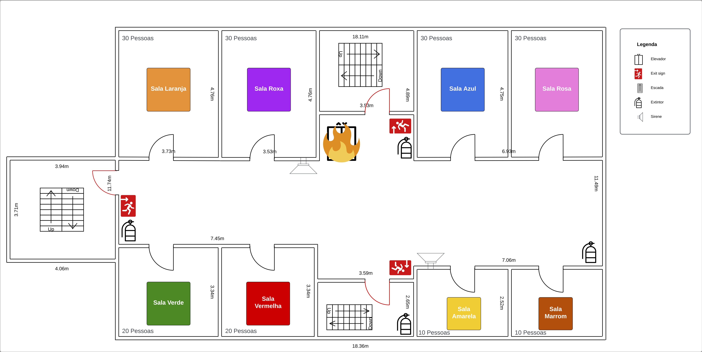

# Planejando a Resposta a um Incidente: Guia da Atividade

## Introdução

Bem-vindo ao guia da atividade "Planejando a Resposta a um Incidente". Nesta atividade, você e sua equipe enfrentarão um cenário de incêndio em um elevador, aplicando práticas eficazes de gerenciamento de incidentes para desenvolver um plano de ação claro.

> Um incêndio ocorreu no elevador de um edifício, apresentando um risco significativo aos ocupantes e à estrutura do prédio. Sua equipe deve responder rapidamente para garantir a segurança de todos e minimizar os danos.

## Perguntas Chave

1. **Quais papéis são necessários durante o gerenciamento do incêndio no elevador e quais são as responsabilidades de cada papel?**
   - *Exemplo:* Identificar papéis como líder de evacuação, comunicador principal, responsável pela segurança, etc.

2. **Qual é o plano de comunicação durante o incêndio, incluindo os canais de comunicação, a frequência das atualizações e os principais grupos a serem informados?**
   - *Exemplo:* Definir se serão usadas mensagens de texto, rádio, ou outros meios; com que frequência as atualizações serão feitas; e quem precisa ser informado (ex.: equipe de bombeiros, funcionários do prédio).

3. **Como a equipe classificará a gravidade do incêndio no elevador e quais critérios serão utilizados para essa avaliação?**
   - *Exemplo:* Definir critérios como a intensidade do fogo, a proximidade a pessoas, e o potencial de propagação para determinar a gravidade do incidente.

4. **Quais são as rotas de evacuação recomendadas considerando o incêndio no elevador e quais medidas de segurança devem ser tomadas ao planejar essas rotas?**
   - *Exemplo:* Planejar rotas de saída seguras e alternativas; considerar bloqueios, presença de fumaça e acessibilidade das saídas.

5. **Quais recursos e ferramentas são necessários para gerenciar o incêndio no elevador e como esses recursos devem ser utilizados de forma eficaz?**
   - *Exemplo:* Listar recursos como extintores de incêndio, lanternas e kits de primeiros socorros; definir como e quando esses recursos devem ser usados durante o incidente.

## Instruções da Atividade

- Vocês têm `10 minutos` para completar a atividade.
- Utilize o mapa fornecido para identificar áreas críticas, incluindo a localização do incêndio, saídas de emergência, rotas potencialmente perigosas e áreas seguras.
- Avalie os riscos associados a diferentes partes do prédio, considerando fatores como densidade de ocupação, materiais inflamáveis e acessibilidade.
- Com base na análise do mapa, planeje rotas de evacuação seguras e eficientes.
- Considere rotas alternativas para acomodar condições inesperadas, como bloqueios ou áreas com fumaça intensa.
- **Vocês devem responder às seguintes perguntas-chave sobre o gerenciamento do incêndio no elevador.**

## Informações dos Outros Integrantes do Grupo

- **Coordenador de Evacuação**: Especialista em rotas de evacuação.
- **Gerente de Recursos**: Conhecimento detalhado sobre recursos e ferramentas disponíveis.
- **Consultor de Segurança**: Responsável por assessorar sobre procedimentos de segurança durante emergências.

## RESPOSTA À EMERGÊNCIA

> **🔥🔥🔥 Emergência Simulada: Uma explosão no elevador causou um incêndio. A área afetada está marcada em vermelho no mapa. 🔥🔥🔥**
>
> **Sua missão é**: Evacuar o andar da melhor maneira possível buscando diminuir ao máximo o número de pessoas afetadas pelo incêndio.

**Resultado Esperado**:
Ao final desta atividade, cada equipe deve ter um plano claro de evacuação e comunicação durante a emergência, visualizado com post-its no quadro. Este plano deve incluir rotas de evacuação, responsabilidades de cada membro da equipe e protocolos de comunicação.