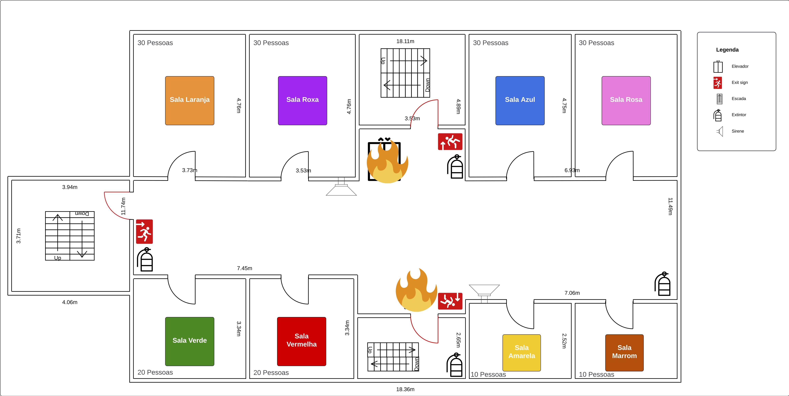
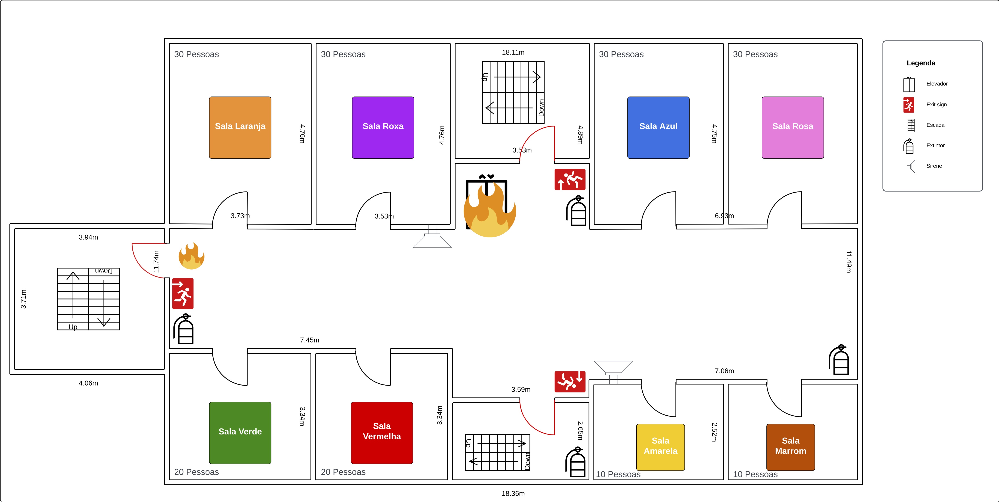
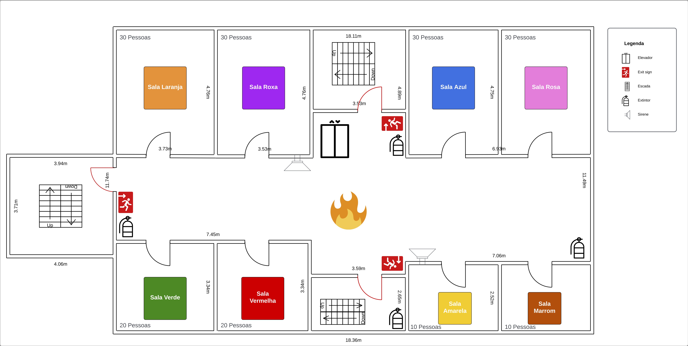

# 1. Planejando a Resposta a um Incidente: Atividade PREP

## Objetivo 🎯
Praticar os conceitos de gerenciamento de incidentes, focando na definição de rotas de evacuação e na comunicação eficaz durante uma emergência.

## Materiais 📌
- Mapa impresso do edifício para cada equipe.
- Quadro e post-its.
- Canetas.

## Desafio 🚨
Simular uma situação de emergência no edifício e planejar a evacuação mais eficiente e segura.

## Passo-a-Passo ⏱

1. **Configuração da Situação de Emergência**:
    - Distribua um mapa do edifício a cada equipe.
    - Apresente a emergência simulada: uma explosão no elevador causando um incêndio. Área afetada marcada em vermelho no mapa.
    - Instrua as equipes a desenvolverem um plano de evacuação abrangente, que inclua rotas de evacuação, atribuição de responsabilidades, estratégias de comunicação e preparação de recursos de emergência.

2. **Desenvolvimento do Plano de Evacuação**:
    - As equipes usam post-its para marcar rotas de evacuação, pontos de encontro e localização dos recursos de emergência.
    - Atribuição de papéis específicos e definição de procedimentos de comunicação durante a evacuação.

3. **Simulação de Chaos Engineering**:
    - Forneça novos mapas com cenários de caos para cada equipe.
    - As equipes devem adaptar rapidamente seus planos de evacuação aos novos desafios.

4. **Apresentação e Feedback**:
    - As equipes apresentam seus planos de evacuação detalhados.
    - Discussão em grupo sobre os pontos fortes e as áreas de melhoria de cada plano.

### Cenários Extras de Chaos Engineering 🌀

- **Sem Alarmes**: Mapa sem alertas de fogo, exigindo comunicação manual de emergência.
  

- **Ocupação Dinâmica**: Mapa com número alterado de pessoas por sala, desafiando a contagem e priorização de evacuação.
  

- **Fogo na setor inferior**: Fogo na parte inferior do andar, bloqueando duas saídas e exigindo novas rotas de evacuação.
  

- **Fogo no setor esquerdo**: Fogo na parte esquerda do andar, bloqueando duas saídas e testando a flexibilidade do plano de evacuação.
  

- **Fogo no setor central**: Fogo no centro do andar, impactando a maioria das rotas e exigindo uma reavaliação completa do plano de evacuação.
  
## Critérios de Aceite ✅

- **Conexão das Salas às Saídas**: Cada sala está claramente conectada a uma saída de emergência específica?
- **Ordem de Saída das Salas**: O plano especifica a ordem de evacuação para cada sala ou área do edifício?
- **Procedimentos de Contagem de Pessoas**: Há um método eficaz para contar e verificar a presença de todas as pessoas no ponto de encontro?
- **Plano para Pessoas com Necessidades Especiais**: O plano aborda adequadamente a evacuação de pessoas com deficiência ou necessidades especiais?
- **Clareza dos Anúncios de Emergência**: Existe um plano para anúncios de emergência claros e eficazes?
- **Procedimentos para Comunicação Externa**: O plano inclui procedimentos claros para comunicar a situação a serviços de emergência externos, como bombeiros e ambulâncias?

