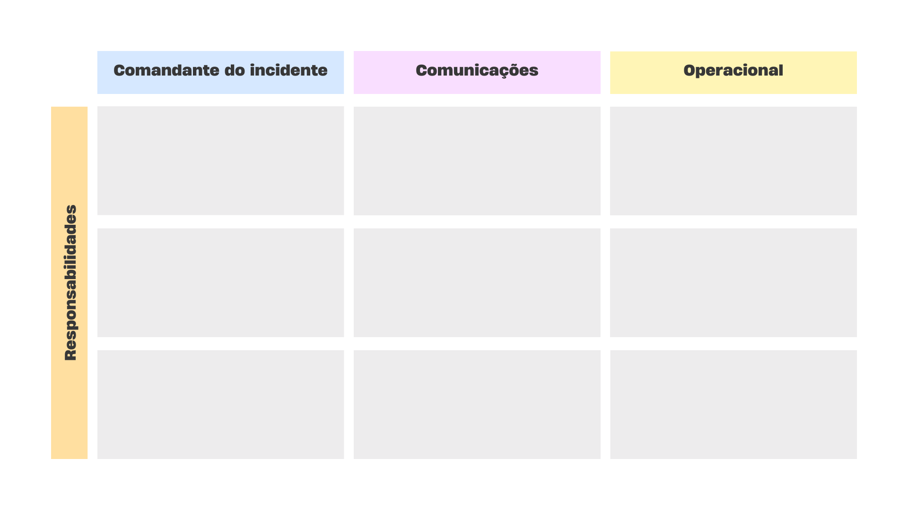

## 1. Planejando a Resposta a um Incidente: Guia da Atividade

> 1. **Emergência Simulada**: As equipes enfrentam um incidente após uma explosão no elevador de um edifício.
> 2. **Preparação, Classificação e Resposta**: As equipes primeiro se preparam designando papéis e estabelecendo protocolos; depois, classificam a gravidade do incidente e finalmente planejam rotas de evacuação.
> 3. **Objetivo Principal**: Aplicar práticas eficazes de gerenciamento de incidentes em um cenário de alta pressão, culminando em um plano de ação claro visualizado no quadro.

🔥 **Emergência Simulada**: Uma explosão no elevador causou um incêndio. A área afetada está marcada em vermelho no mapa.

### FASE 1 - RESPOSTA À EMERGÊNCIA

> **Sua missão é**: Evacuar o andar da melhor maneira possível buscando diminuir ao máximo o número de pessoas afetadas pelo incêndio.

**Instruções**:
1. **Estabeleça Rotas de Evacuação**:
    - Use o mapa fornecido acima.
    - Planeje rotas de evacuação seguras.
    - Marque suas rotas com post-its no quadro.

### FASE 2 - PREPARAÇÃO ANTES DA CRISE

> **Sua missão é**: Estabelecer a responsabilidade de cada um dos principais papéis na resposta a incidentes com o intuito de diminuir o tempo de resposta em caso de incidente.

**Instruções**:
1. **Determine Responsabilidades**:
    - O Incident Commander (IC) é o principal responsável pela coordenação e decisões estratégicas durante o gerenciamento de um incidente. 
    - Liste, com post-its no quadro, as principais responsabilidades de um IC.
    - Discuta e planeje a resposta do IC para diferentes cenários.

2. **Defina a Comunicação**:
    - O Comms Lead define um plano de comunicação: canais, frequência de atualizações e stakeholders.
    - Estabeleça um protocolo para registrar todas as comunicações. 
    - Estabeleça como, quando e para quem comunicar durante a emergência.
    - Liste, com post-its no quadro, os protocolos de comunicação estabelecidos.

3. **Coordenação Técnica**:
    - O Ops Lead identifica e prepara os recursos técnicos necessários para enfrentar o incidente.
    - Criar uma lista de recursos, como documentações, scripts ou playbooks, que podem ser rapidamente acessados durante um incidente.
    - Use post-its para registrar as ações específicas para resolver o incidente.

### FASE 3 - CLASSIFICAÇÃO DO INCIDENTE

> **Sua missão é**: Classificar o incidente ocorrido e classificá-lo de acordo com seu grau de severidade, ou seja, o quão grave ele foi. Essa atividade é importante pois a urgência da resposta é programada de acordo com a severidade, 

**Instruções**:

1. **Definição da Severidade do Incidente:**
   - É crucial determinar a gravidade do incidente. A severidade pode variar de 1 (mais grave) a 5 (menos grave).
   - A severidade determina a urgência da resposta e a quantidade de recursos alocados para gerenciar a situação.
   - Determine, para esta simulação, a severidade do incidente devido ao potencial risco imediato à vida.

**Resultado Esperado**:
Ao final desta atividade, cada equipe deve ter um plano claro de evacuação e comunicação durante a emergência, visualizado com post-its no quadro. Este plano deve incluir rotas de evacuação, responsabilidades de cada membro da equipe e protocolos de comunicação.
