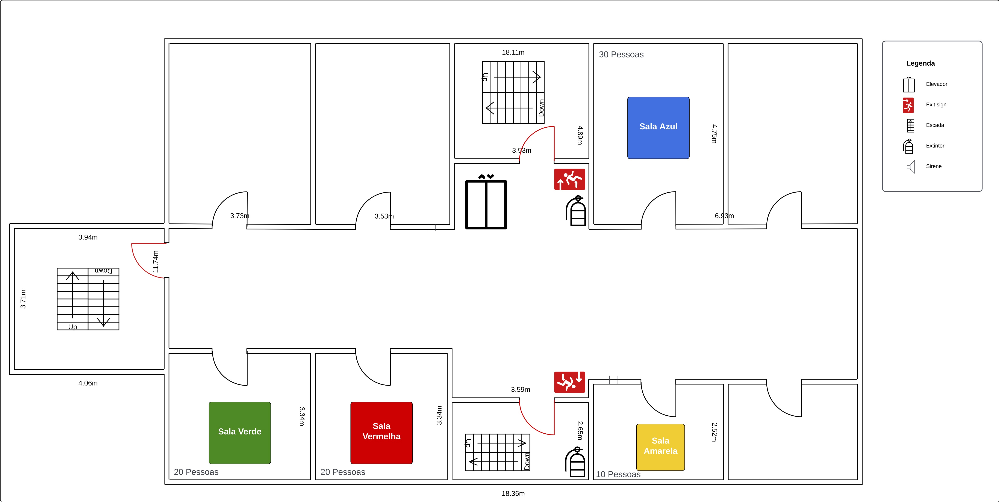

# Planejando a Resposta a um Incidente: Guia da Atividade

> 1. **Emergência Simulada**: As equipes enfrentam um incidente após uma explosão no elevador de um edifício.
> 
> 2. **Preparação, Classificação e Resposta**: As equipes primeiro se preparam designando papéis e estabelecendo protocolos; depois, classificam a gravidade do incidente e finalmente planejam rotas de evacuação.
> 
> 3. **Objetivo Principal**: Aplicar práticas eficazes de gerenciamento de incidentes em um cenário de alta pressão, culminando em um plano de ação claro visualizado no quadro.

# 🚨 Desafio
Diante de um cenário crítico de explosão em um elevador, você e sua equipe devem dominar as práticas de gerenciamento de emergências, desde a preparação e classificação da crise até a execução de uma resposta eficaz, resultando em um plano de ação claro e preciso.

> **Sua missão é**: Navegar eficientemente através de uma crise simulada, estabelecendo papéis claros, comunicando-se eficazmente e planejando uma evacuação estratégica, aplicando práticas de gerenciamento de incidentes para garantir a segurança e a rápida recuperação do ambiente.

## FASE 1 - PREPARAÇÃO ANTES DA CRISE

**Instruções**:
1. **Determine Responsabilidades**:
    - O Incident Commander (IC) é o principal responsável pela coordenação e decisões estratégicas durante o gerenciamento de um incidente. 
    - Liste, com post-its no quadro, as principais responsabilidades de um IC.
    - Discuta e planeje a resposta do IC para diferentes cenários.

2. **Defina a Comunicação**:
    - O Comms Lead define um plano de comunicação: canais, frequência de atualizações e stakeholders.
    - Estabeleça um protocolo para registrar todas as comunicações. 
    - Estabeleça como, quando e para quem comunicar durante a emergência.
    - Liste, com post-its no quadro, os protocolos de comunicação estabelecidos.

3. **Coordenação Técnica**:
    - O Ops Lead identifica e prepara os recursos técnicos necessários para enfrentar o incidente.
    - Criar uma lista de recursos, como documentações, scripts ou playbooks, que podem ser rapidamente acessados durante um incidente.
    - Use post-its para registrar as ações específicas para resolver o incidente.

## FASE 2 - CLASSIFICAÇÃO DO INCIDENTE

**Instruções**:
1. **Definição da Severidade do Incidente:**
   - É crucial determinar a gravidade do incidente. A severidade pode variar de 1 (mais grave) a 5 (menos grave).
   - A severidade determina a urgência da resposta e a quantidade de recursos alocados para gerenciar a situação.
   - Determine, para esta simulação, a severidade do incidente devido ao potencial risco imediato à vida.

## FASE 3 - RESPOSTA À EMERGÊNCIA

> **🔥🔥🔥 Emergência Simulada: Uma explosão no elevador causou um incêndio. A área afetada está marcada em vermelho no mapa. 🔥🔥🔥** 
> 
> **Sua missão é**: Evacuar o andar da melhor maneira possível buscando diminuir ao máximo o número de pessoas afetadas pelo incêndio.

**Instruções**:
1. **Análise do Mapa e Identificação de Áreas Críticas**:
   - Utilize o mapa fornecido para identificar áreas críticas, incluindo a localização do incêndio, saídas de emergência, rotas potencialmente perigosas e áreas seguras.
   - Avalie os riscos associados a diferentes partes do prédio, considerando fatores como densidade de ocupação, materiais inflamáveis e acessibilidade.

2. **Desenvolvimento de Rotas de Evacuação**:
   - Com base na análise do mapa, planeje rotas de evacuação seguras e eficientes.
   - Considere rotas alternativas para acomodar condições inesperadas, como bloqueios ou áreas com fumaça intensa.

3. **Estratégias de Comunicação Durante a Evacuação**:
   - Liste funções específicas no plano de evacuação, como líderes de rota, responsáveis pela contagem de pessoas e coordenadores de comunicação.
   - Estabeleça um protocolo de comunicação claro para a evacuação, incluindo quem irá comunicar, como e quais informações serão transmitidas.

**Resultado Esperado**:
Ao final desta atividade, cada equipe deve ter um plano claro de evacuação e comunicação durante a emergência, visualizado com post-its no quadro. Este plano deve incluir rotas de evacuação, responsabilidades de cada membro da equipe e protocolos de comunicação.
