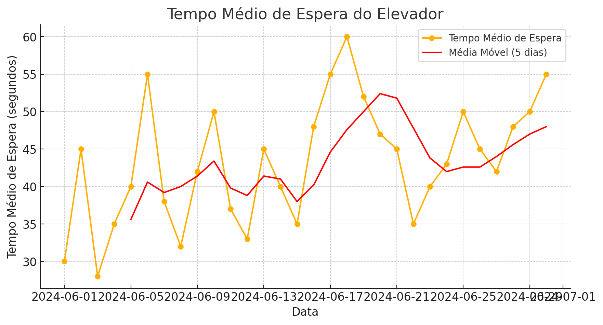
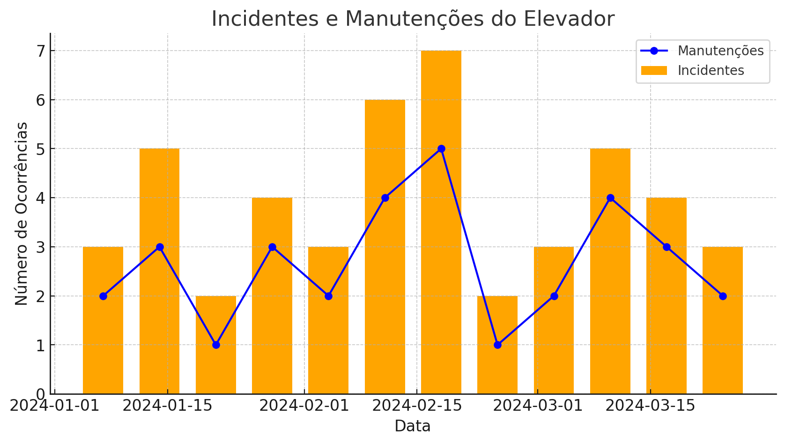
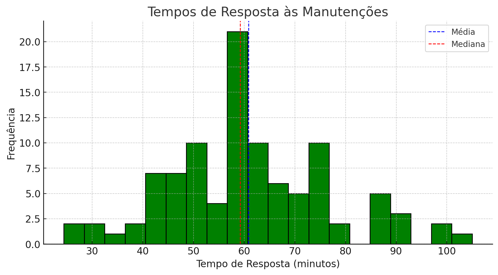
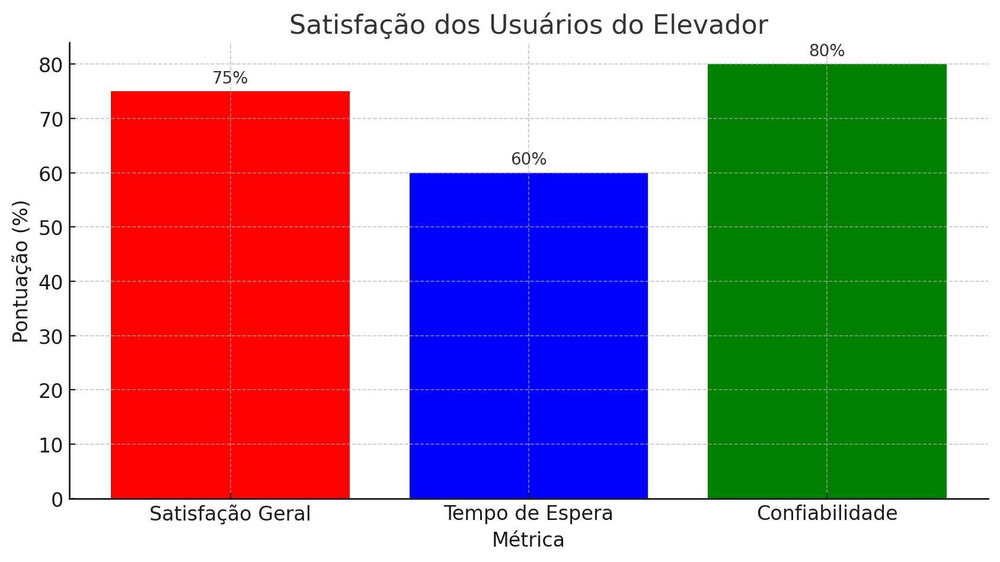

# Definindo e Visualizando SLIs, SLOs, SLAs: Guia da Atividade

## Introdução

Bem-vindo ao guia da atividade "Definindo e Visualizando SLIs, SLOs, SLAs". Nesta atividade, você e sua equipe enfrentarão o desafio de criar um sistema de monitoramento robusto para os serviços essenciais de um edifício após um incidente, aplicando práticas eficazes de monitoramento e observabilidade.

## Contexto da Atividade

Após um incidente no edifício, as equipes são encarregadas de criar um sistema de monitoramento robusto para os serviços essenciais. O objetivo é desenvolver e visualizar um sistema de monitoramento eficaz, com a opção de discutir potenciais SLAs para garantir a adesão aos padrões estabelecidos.

## Desafio

Confrontados com a tarefa crítica de aprimorar a confiabilidade dos serviços após um incidente, as equipes devem estabelecer métricas de desempenho chave, visualizar objetivos de serviço e considerar acordos de nível de serviço para assegurar a excelência contínua.

**Sua missão é**: Criar um sistema de monitoramento detalhado e visual para os serviços essenciais do edifício, definindo e alinhando SLIs, SLOs e SLAs, assegurando assim a resiliência e a confiabilidade dos sistemas vitais do edifício.

## Perguntas Chave

1. **Quais são os SLIs (Service Level Indicators) mais importantes para monitorar os serviços essenciais do edifício?**
   - *Exemplo:* Identificar SLIs como tempo médio de espera do elevador, percentual de tempo de atividade, taxa de erros.

2. **Qual é o SLO (Service Level Objective) adequado para o serviço de elevador, considerando os SLIs definidos?**
   - *Exemplo:* Definir um SLO como 99.9% de tempo de atividade do elevador e tempo médio de espera abaixo de 2 minutos.

3. **Como você visualizaria os SLIs e SLOs em um dashboard de monitoramento?**
   - *Exemplo:* Criar um esboço de dashboard que inclui gráficos de linha, indicadores de status, e alertas para métricas críticas.

## Lista de Documentos

### 1. Gráfico de Tempo Médio de Espera do Elevador

**Descrição:** Este gráfico de linhas mostra o tempo médio de espera do elevador ao longo de um período de 30 dias. A linha de tendência (média móvel de 5 dias) ajuda a identificar tendências gerais e padrões de alta demanda.
**Interpretação:** Use este gráfico para analisar a variação diária do tempo de espera do elevador e identificar quaisquer picos ou padrões. A linha de tendência pode ajudar a visualizar se os tempos de espera estão aumentando, diminuindo ou se permanecem estáveis ao longo do tempo.

### 2. Gráfico Combinado de Incidentes e Manutenções

**Descrição:** Este gráfico combinado apresenta barras para o número de incidentes e uma linha para o número de manutenções realizadas por semana ao longo de um período de 12 semanas.
**Interpretação:** Este gráfico ajuda a comparar a frequência de incidentes e manutenções. Use-o para identificar semanas com altas taxas de incidentes ou manutenções e verificar se há uma correlação entre os dois. Pode também indicar a eficácia das manutenções preventivas.

### 3. Histograma de Tempos de Resposta às Manutenções

**Descrição:** Este histograma mostra a distribuição dos tempos de resposta para as manutenções do elevador. Linhas de média e mediana são adicionadas para ajudar na interpretação.
**Interpretação:** Use este histograma para entender a eficiência do tempo de resposta das equipes de manutenção. A média e a mediana ajudam a identificar o tempo de resposta típico, enquanto a distribuição pode revelar variações significativas e oportunidades de melhoria.

### 4. Gráfico de Satisfação dos Usuários do Elevador

**Descrição:** Este gráfico de barras exibe os resultados de uma pesquisa de satisfação dos usuários do elevador, com métricas como "Satisfação Geral", "Tempo de Espera" e "Confiabilidade".
**Interpretação:** Este gráfico permite avaliar a satisfação dos usuários em diferentes aspectos do serviço do elevador. As anotações nos gráficos facilitam a leitura rápida dos resultados. Use essas informações para identificar áreas que necessitam de melhorias e para definir metas de satisfação do usuário.

## Dinâmica da Atividade

### 1. Definindo SLIs (3 minutos)

- **Objetivo:** Identificar e definir os Indicadores de Nível de Serviço (SLIs).
- **Instruções:** Distribuir gráficos e informações iniciais sobre os serviços essenciais do edifício. As equipes devem analisar os dados e identificar SLIs cruciais.

### 2. Determinando SLOs para o Elevador (3 minutos)

- **Objetivo:** Estabelecer Objetivos de Nível de Serviço (SLOs) baseados nos SLIs identificados.
- **Instruções:** As equipes discutem e determinam SLOs realistas e alcançáveis para o sistema de elevador.

### 3. Desenhando um Dashboard (3 minutos)

- **Objetivo:** Criar uma representação visual (dashboard) para monitorar os SLIs e SLOs definidos.
- **Instruções:** Fornecer materiais para as equipes esboçarem um dashboard que mostre as principais métricas e objetivos.

Exemplo de Dashboard:

### Conclusão e Discussão (1 minuto)

- Discutir brevemente os potenciais SLAs baseados nos SLOs definidos.
- Destacar a importância dos SLAs para garantir a excelência contínua dos serviços.
- Refletir sobre a aplicação desses conceitos no ambiente de trabalho dos participantes.

### Resultado Esperado

Os grupos devem apresentar um dashboard visual no quadro, utilizando post-its para ilustrar os SLIs e SLOs definidos. O dashboard deve mostrar claramente as métricas escolhidas, os objetivos estabelecidos e, se discutido, os potenciais SLAs.

## Conclusão

Esses SLOs são essenciais para garantir a alta disponibilidade e a confiabilidade do sistema de elevador, ajudando a prevenir futuros incidentes e a melhorar a satisfação dos usuários.
