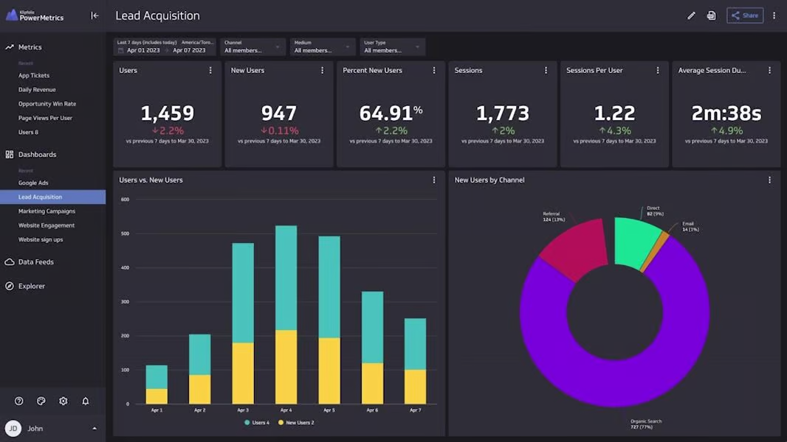

# Definindo e Visualizando SLIs, SLOs, SLAs: Guia da Atividade

> 1. **Desafio de Monitoramento**: Após um incidente no edifício, as equipes são encarregadas de criar um sistema de monitoramento robusto para os serviços essenciais.
> 
> 2. **Identificação, Definição e Visualização**: As equipes identificarão KPIs cruciais, estabelecerão SLIs e SLOs e, em seguida, criarão um dashboard visual para representar essas métricas.
> 
> 3. **Objetivo Principal**: Desenvolver e visualizar um sistema de monitoramento eficaz, com a opção de discutir potenciais SLAs para garantir a adesão aos padrões estabelecidos.

## FASE 1 - DEFINIÇÃO DE INDICADORES DE SERVIÇOS

> **Sua missão é**: Implementar um sistema robusto de monitoramento para serviços prediais, definindo SLIs e SLOs claros, como o funcionamento contínuo do elevador com um objetivo de 99.5% de operacionalidade semanal.

**Instruções**:
1. **Contexto**:
    - Após um incidente recente, há uma necessidade urgente de melhorar o monitoramento dos serviços do edifício.
2. **Defina SLIs**:
    - Defina SLIs (Indicadores de Nível de Serviço).
    - Exemplo SLI: Percentual de tempo que o elevador está operacional.
3. **Defina SLOs**:
    - Estabeleça SLOs (Objetivos de Nível de Serviço) para cada SLI.
    - Exemplo SLO: O elevador deve estar operacional 99.5% do tempo em uma semana.

## FASE 2 - CONSTRUÇÃO DO DASHBOARD

> **Sua missão é**: Desenvolver um dashboard físico interativo, utilizando quadro e post-its, para exibir de forma clara os SLIs e SLOs estabelecidos, permitindo um acompanhamento tangível e atualizável do desempenho dos serviços do edifício.

**Instruções**:
1. **Crie um Dashboard Físico**:
    - Usando o quadro e post-its, crie um "dashboard" que mostre visualmente os SLIs e SLOs definidos.
 
Exemplo de Dashboard:

**Resultado Esperado**:
Os grupos devem apresentar um dashboard visual no quadro, utilizando post-its para ilustrar os SLIs e SLOs definidos. O dashboard deve mostrar claramente as métricas escolhidas, os objetivos estabelecidos e, se discutido, os potenciais SLAs.
